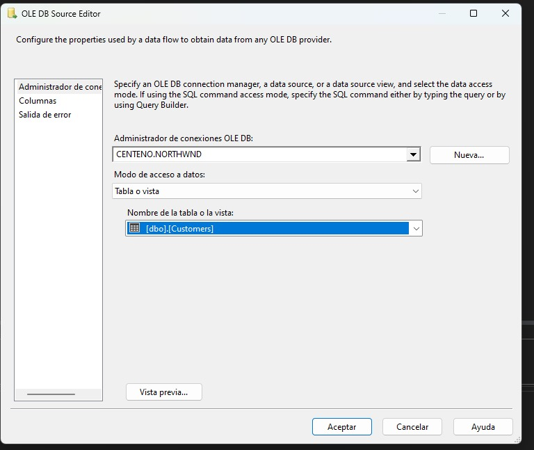
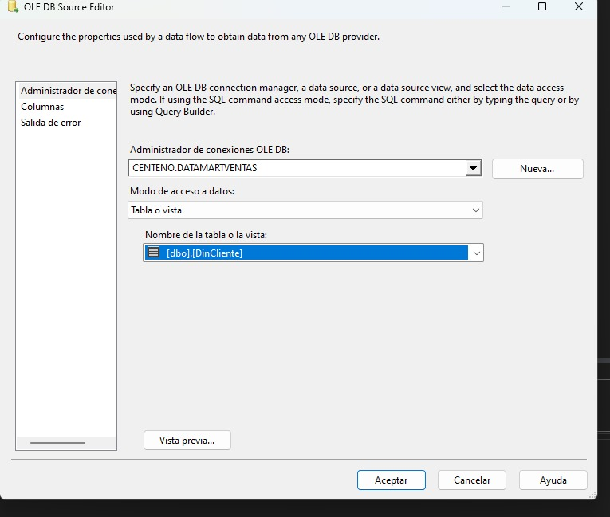
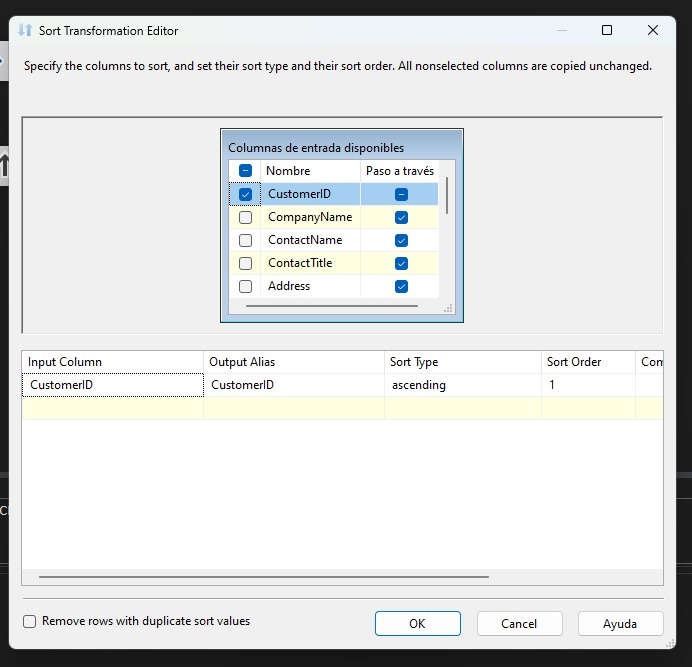
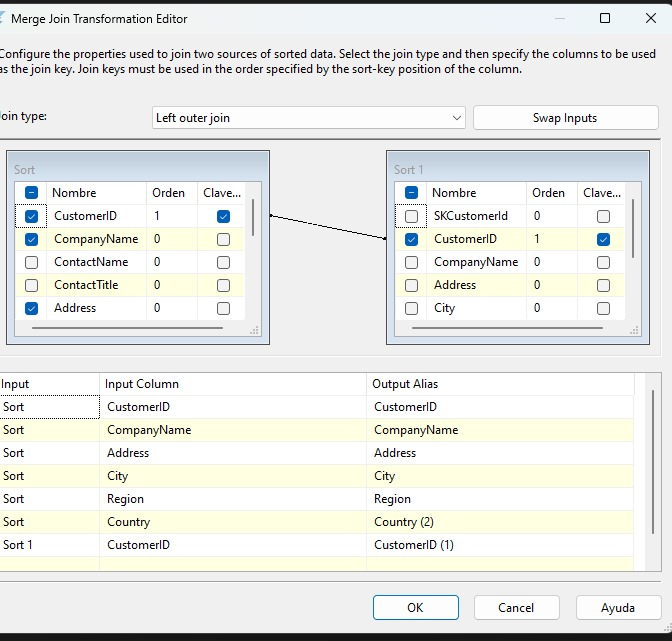
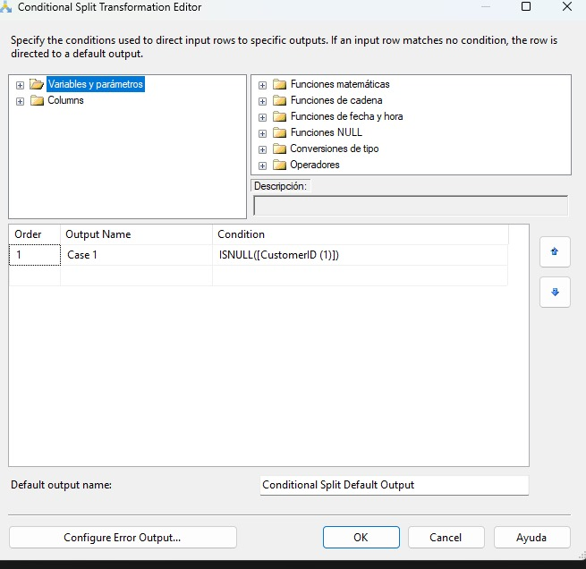

# Proyecto ETL
En este proyecto se documenta la creacion de un ETL del data warehouse DATAMARTVENTAS, 
con el objetivo de llenar sus tablas, utilizando los datos de la base de datos NORTHWIND.
Para despues crear un JOB en base al proyecto de ETL realizado con anterioridad.

### Tabla 'Clientes'
##### 1. Primeramente se hace una conexion a la base de datos NORTHWIND para obtener los datos de la tabla Customers (clientes)

##### 2. Despues se hace la conexión a la base de datos DATAMARTVENTAS e igual se extraen los datos de la tabla DimCliente.

##### 3. Consecuentemente se ordenan primero los datos de la tabla Customers de la base de datos NORTHWIND de forma ascendente

##### 4. Teniendo eso, se realiza un left join y se relacionan los campos id de ambas tablas para comparar.

##### 5. Por ultimo se hace una comparación, la cual es que si en la tabla de Clientes de DATAMARTVENTAS no tiene la misma cantidad de registros que la tabla Customers de NORTHWIND, se insertaran los nuevos datos en la tabla de Clientes

